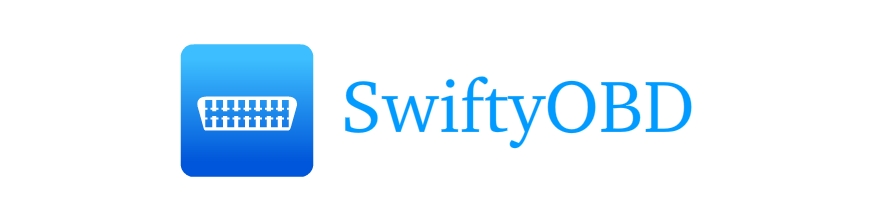

***
## Content
1. [Intro](#intro)
2. [Checklist to run the Example App](#checklist)
    1. [Install Cocoapods dependencies](#installCocoapods)
    2. [Devices and setup used in this project](#devicesAndSetup)
    3. [Get access to the Car Diagnostic API](#accessToAPI)
    4. [Setting client credentials](#setupCredentials)
3. [SwiftyOBD Usage](#usage)
    1. [Define an OBDStreamManager and an OBDAPIManager](#defineManagers)
    2. [Connect and Setup](#connectAndSetup)
    3. [Ask for DTCs](#askForDTCs)
4. [Sending and Parsing Data](#sendingParsingData)
5. [About SwiftyOBD](#about)


***

# Intro <a name="intro"/>
SwiftyOBD is a boilerplate for an iOS App written in Swift that shows you how to
establish a connection between smartphone and an ELM327 OBD WIFI dongle. It
reads data out from the dongle and uses the
*[Car Diagnostic API](https://console.eu-gb.bluemix.net/catalog/services/car-diagnostic-api/)*
from Hella Ventures to translate the error codes stored in the vehicle.

CocoaPods was used to manage third party libraries in this project.
More info about installation and how to use at [https://cocoapods.org](https://cocoapods.org/).

## How to run the Example App <a name="checklist"/>

#### a) Install Cocoapods dependencies <a name="installCocoapods"/>
In order to run the example project, you will need to install the Cocoapods dependencies specifed in the Podfile. All you need to do is go into the project folder and run **pod install** using the terminal.

#### b) Devices and setup used in this project <a name="devicesAndSetup"/>

We used the [Diamex OBD2 Profi Simulator](http://www.diamex.de/dxshop/Diamex-OBD2-Profi-Simulator-alle-Protokolle) and the [Veepeak WiFi OBD2 Scanner for iPhone](https://www.amazon.de/Garantie-veepeak-OBD2-OBD-Auto-Diagnose-motorkontrollleuchte/dp/B00WPW6BAE) for the test and development of this example project.

We also selected the protocol ***7: ISO 15765-4 CAN (29 bit ID,500 Kbaud)*** on
the Diamex Simulator for this simple example (just in cased we missed
something). This is important, since the format of the responses coming from the
dongle may differ according to the selected protocol and therefore need to be
parsed differently. However, all other protocols that are supported by this dongle are
also supported by this App. 

You can of course also plug the OBD2 Dongle into your vehicle to test the application. But you would normaly expect not to find any error codes in your vehicle :). But in any case, the App should be able to connect to the OBD2 port and send and receive data.

>**Note:** Before testing anything you will need to make sure that your device is properly connected to the OBD Dongle. The standard setup goes usually as following:

>1) Plug the OBD Dongle into the OBD2 port on your vehicle (or [OBD2 Simulator](http://www.diamex.de/dxshop/Diamex-OBD2-Profi-Simulator-alle-Protokolle)).

>2) Turn ignition key to the ON position (or turn the OBD2 Simulator on).

>3) Enable WiFI on your device, find the WiFI SSID (e.g. WiFi_OBDII) of your dongle and connect to it.

>4) Go to the WiFI settings, select Static IP Address and enter the following information: IP 192.168.0.10, Subnet Mask 255.255.255.0, and Gateway 192.168.0.10. By doing this step you can use your mobile data. We will need this if we want to get data from the OBD API

#### c) Get access to the Car Diagnostic API <a name="accessToAPI"/>

You will need a client ID and a client secret to be able to make API calls and get data from the Hella Ventures OBD API:

> Follow the [Getting Started Guide](https://github.com/HellaVentures/Car-Diagnostic-API) to get access to the [Car Diagnostic API](https://console.eu-gb.bluemix.net/catalog/services/car-diagnostic-api/).

#### d) Setup your client credentials <a name="setupCredentials"/>

Open the AppDelegate.swift file and set the apiManager's credentials in the `application...didFinishLaunching...`-function as follows:

```swift
 func application(_ application: UIApplication, didFinishLaunchingWithOptions launchOptions: [UIApplicationLaunchOptionsKey: Any]?) -> Bool {
 
        // SETUP the API Manager
        apiManager.client_id = "<<Your API client_id>>" // TODO
        apiManager.client_secret = "<<Your API client_secret>>" // TODO
        
        ...
```

#### e) Run the App <a name="overview"/>

You are ready to go!

## SwiftyOBD Usage <a name="usage"/>

First, import the files from the SwiftyOBD folder of this repo into your
project. If you want to read data out of the OBD Dongle using SwiftyOBD just follow the steps below:

#### 1) Define an OBDStreamManager and an OBDAPIManager <a name="defineManagers"/>
---
Define a global instance of the OBDStreamManager and OBDAPIManager in the AppDelegate.swift right before the beginning of the AppDelegate class.
The OBDStreamManager takes care of the connection, input- and outputStream
between your App and the OBD WiFI dongle. And the OBDAPIManager helps to storage
information related to the Car Diagnostic API. Get an instance of them by calling:

```swift
let streamManager = OBDStreamManager.sharedInstance
let apiManager = OBDAPIManager.sharedInstance
```
You will also need to get and setup your client credentials as explained above
([Setup your client credentials](#setupCredentials)) in order to use the Car
Diagnostic API.

#### 2) Connect to the WiFI and Setup the OBD Dongle <a name="connectAndSetup"/>
---

The next step is to connect to the dongle using the ***connect()*** method. You will need to provide an instance of ***OBDConnection*** as parameter or you can also leave it blank to use the default ***OBDConnection*** that has host ***"192.168.0.10"*** and port ***35000*** as default properties. However, you may want to check if a connection is already opened and close it before opening a new one. So just to be sure you can call the ***disconnect()*** method before.

```swift
streamManager.disconnect()
streamManager.connect() // or streamManager.connect(OBDConnection(host: "192.168.0.10", port: 35000))
```
Or you could use instead the startStreaming method which does both for you at once. 
```swift
streamManager.startStreaming() // or streamManager.startStreaming(OBDConnection(host: "192.168.0.10", port: 35000))
```

The following step is to call the ***setupAdapter()*** method which is used determine which protocol is used by the Vehicle OBD2 port. You will need to call this in a separate Thread in order to run properly. An example of a basic Connect and Setup ViewController could look as following:

```swift
class ViewController: UIViewController, OBDStreamManagerDelegate {
    
    override func viewDidLoad() {
        super.viewDidLoad()
        obdStreamManager.delegate = self
        obdStreamManager.startStreaming()
        Timer.scheduledTimer(timeInterval: 1.0, target: self, selector: #selector(self.timedTunc), userInfo: nil, repeats: false)
    }
    
    override func didReceiveMemoryWarning() {
        super.didReceiveMemoryWarning()
    }
    
    func timedTunc(){
        obdStreamManager.setupAdapter()
    }
    
    func setupProgress(_ progress: Double) {
        print(progress)
        
        //If progress is 100 then I know that the setup is finished and do something.
    }
}

```

If you implement the ***setupProgress()*** callback method from the OBDStreamManagerDelegate protocol you can have an idea of how far the setup is from finishing.


#### 3) Ask for DTCs <a name="askForDTCs"/>
---
Once the stream is opened and the setup is done we can use the ***requestDTCs()*** method of the stream manager to get the error codes. However, since the manager is sending data to the OBD2 Dongle in the background and the response may come with some delay you will need to implement the ***DTCsUpdated()*** callback method from the OBDStreamManagerDelegate protocol which passes the error codes back as parameter.

```swift
class ResultsTableViewController: UIViewController, OBDStreamManagerDelegate{
    
    var dtcsArray: [String] = []
    
    override func viewDidLoad() {
        streamManager.delegate = self
        super.viewDidLoad()
        
        streamManager.requestDTCs()
    }

    // MARK: OBD STREAM MANAGER PROTOCOL IMPLEMENTATION
    func DTCsUpdated(_ newDTCs: [String], dtcs: Int) {
        self.dtcsArray = newDTCs
        
        if(newDTCs.count == dtcs){
            Timer.scheduledTimer(timeInterval: 1.0, target: self, selector: #selector(self.timedFunc), userInfo: nil, repeats: false)
        }
    }
    
    func timedFunc(){
        self.error = false
        if dtcsArray.count > 0 {
            for i in 0...dtcsArray.count-1 {
                makeAPIRequest(i)
            }
        }
    }
    
    func makeAPIRequest(_ errorCodeNumber: Int){
        
        let parameters = [
            "code_id":dtcsArray[errorCodeNumber],
            "vin":apiManager.vin,
            "language":apiManager.language,
            "client_secret":apiManager.client_secret,
            "client_id": apiManager.client_id
        ]
        
        Alamofire.request(apiManager.api_address, parameters: parameters).responseJSON { response in
                
            if let responseJSON = response.result.value {
                let swiftyJSONObject = JSON(responseJSON)
                let dtcObject = OBDDTC.parseFronJSON(swiftyJSONObject, withDTC: self.dtcsArray[errorCodeNumber])
                
                if let uDTCObject = dtcObject {
                    print("Translated DTC using API ")
                }
            }else{
                print("JSON is nil")
            }
        }
    }
}

```
## Sending and Parsing Data <a name="sendingParsingData"/>

If you want to know
more about requesting and parsing data, you might want  to take a look at the
speficifications of the ELM327 module
([**ELM327 Specs**](https://www.elmelectronics.com/wp-content/uploads/2016/07//ELM327DS.pdf)).
If you take for example a look at the specifications (page 34) you can find
information about how to interprete trouble codes and also other things.

Feel free to take a look at the OBDParser and OBDStreamManager classes where you
can find how I implemented the parsing and data sending part and improve it if
you want.

## About SwiftyOBD <a name="about"/>
This example App uses dependencies based on the work of the following GitHub contributors. 

* **[Alamofire](https://github.com/Alamofire/Alamofire)**: Elegant HTTP Networking in Swift.
* **[SwiftyJSON](https://github.com/SwiftyJSON/SwiftyJSON)**: The better were to deal with JSON data in Swift.
* **[Eureka](https://github.com/xmartlabs/Eureka)**: Elegant iOS form builder in Swift 3.
* **[XCGLogger](https://github.com/DaveWoodCom/XCGLogger)**: A debug log framework for use in Swift projects.
* **[DZNEmptyDataSet](https://github.com/dzenbot/DZNEmptyDataSet)**: A drop-in UITableView/UICollectionView superclass category for showing empty datasets whenever the view has no content to display.
* **[iOS CircleProgressView](https://github.com/CardinalNow/iOS-CircleProgressView)**: This control will allow a user to use code instantiated or interface builder to create and render a circle progress view. 
